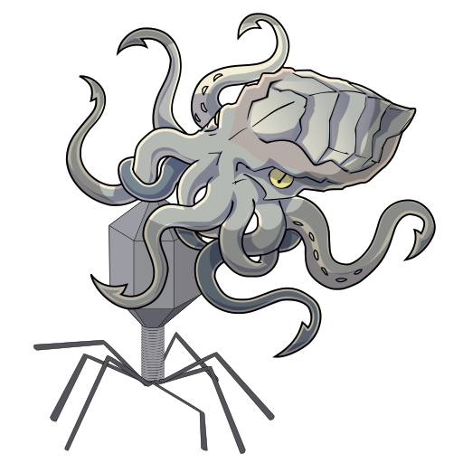

<!-- markdownlint-disable -->
<p align="center">
    
</p>

# v-met

[](https://github.com/ksumngs/v-met/actions/workflows/ci.yml)
[](https://ksumngs.github.io/v-met)
[](https://www.repostatus.org/#wip)
[](https://www.nextflow.io/)
[](https://github.com/ksumngs/v-met/blob/master/CHANGELOG.md)
[](https://github.com/ksumngs/v-met/blob/master/LICENSE)

<!-- markdownlint-enable -->

A bare-bones, ridiculously simple metagenomics pipeline for viruses using
[Kraken 2] written in [Nextflow].

> This project follows the [semver] _pro forma_ and uses the [git-flow]
> branching model.

## Installation

1. Install [Nextflow] (>= 21.10.6)
2. Install [Conda]
3. Install one or more of
   - [Singularity] (**Recommended**)
   - [Podman]
   - [Docker]
4. Download a [Kraken2 database]
5. Download a [BLAST database]

Check out the [Installation] docs for a more nuanced take on the requirements.

## Usage

### Syntax

```bash
nextflow run ksumngs/v-met               \
  -profile <singularity,podman,docker>   \
  --platform <illumina,nanopore>         \
  --kraken2_db /path/to/kraken2/database \
  --blast_db /path/to/blast/database     \
  [--input /path/to/reads/folder]        \
  [--blast_target list]                  \
  [--outdir /path/to/output]
```

### Example: Illumina reads with a relatively complete Kraken2 database

```bash
nextflow run ksumngs/v-met          \
  -profile singularity               \
  --platform illumina                \
  --kraken2_db /databases/kraken2/nt \
  --blast_target 'none'
```

### Example: Nanopore reads with a viral-only Kraken2 database

```bash
nextflow run ksumngs/v-met             \
  -profile podman                       \
  --platform nanopore                   \
  --kraken2_db /databases/kraken2/viral \
  --blast_db /databases/blast/          \
  --blast_target classified
```

There are _way_ more parameters than listed here. For a more complete
description, please read the docs on [Usage] and [Parameters].

[blast database]: https://www.ncbi.nlm.nih.gov/books/NBK569850/
[docker]: https://docs.docker.com/engine/installation
[git-flow]: https://nvie.com/posts/a-successful-git-branching-model
[installation]: https://ksumngs.github.io/v-met/install
[kraken 2]: https://github.com/DerrickWood/kraken2
[kraken2 database]: https://github.com/DerrickWood/kraken2/wiki/Manual#custom-databases
[nextflow]: https://nextflow.io
[parameters]: https://ksumngs.github.io/v-met/parameters
[podman]: https://podman.io
[semver]: https://semver.org
[singularity]: https://www.sylabs.io/guides/3.8/user-guide
[usage]: https://ksumngs.github.io/v-met/usage
